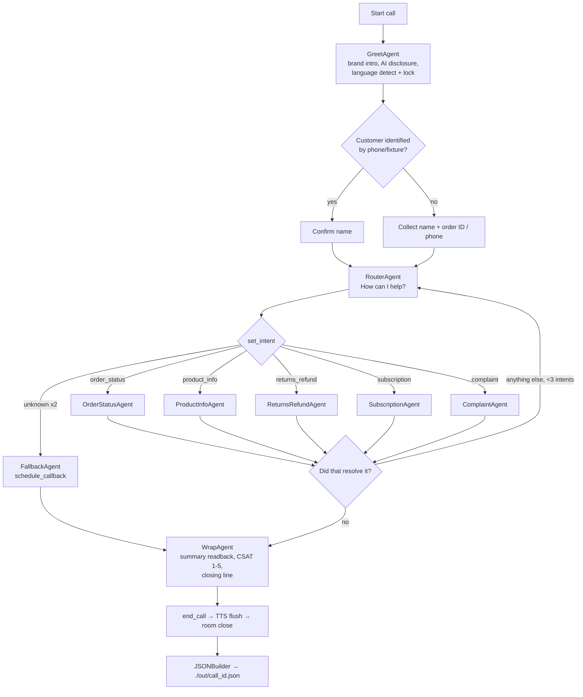

# PRD: Decode Age Customer Support Voice Agent (Desktop Phase)

| | |
|---|---|
| Owner | Akhil, Head of AI |
| Version | 1.0, 9 Sep 2026 |
| Phase | Desktop prototype, no telephony |
| Status | Ready for development |

---

## 1. Objective

Build a voice AI agent that runs entirely on a developer desktop, is triggered by a button, holds a natural customer-support conversation for Decode Age like a veteran support executive, captures all required information, closes the call politely, and emits the full conversation as a structured JSON file.

Telephony (Exotel) is explicitly out of scope for this phase. The agent code must be written so that adding telephony later is a transport/config change only.

## 2. Scope

### In scope
- One-click call start from a local browser UI
- Real-time speech in and out (Sarvam STT, Sarvam TTS)
- LLM reasoning and tool calling via OpenRouter
- Multi-stage conversation: greet, identify, route intent, resolve, loop, wrap
- Six support intents: order status, product info, returns/refunds, subscription, complaint, fallback/escalation
- Guardrails: off-topic, PII, health-claim filter, silence timers, call caps
- Deterministic JSON output per call
- Local persistence (Postgres), tracing (Langfuse), recordings (MinIO)
- Automated persona-based regression harness

### Out of scope (this phase)
- PSTN/SIP telephony, Exotel
- Live Shopify/HubSpot/Intercom writes (mock fixtures only; read-only Shopify optional in M8)
- Human transfer (stubbed as `schedule_callback`)
- Production deployment, auth, multi-tenant

## 3. External dependencies (only three)

| Service | Purpose | Key |
|---|---|---|
| Sarvam STT (`saaras:v3`, realtime WebSocket) | speech to text, Indic + en-IN | `SARVAM_API_KEY` |
| Sarvam TTS (`bulbul:v3`, streaming WebSocket) | text to speech | `SARVAM_API_KEY` |
| OpenRouter | LLM with tool calling (OpenAI-compatible) | `OPENROUTER_API_KEY` |

Everything else is open source and runs locally.

## 4. System architecture

```
┌──────────────────────────────────────────────────────────────────────────┐
│  DEVELOPER DESKTOP                                                       │
│                                                                          │
│  ┌────────────────────┐  POST /calls      ┌────────────────────────┐    │
│  │ UI  :3000          │ ────────────────▶ │ FastAPI  :8000         │    │
│  │ LiveKit React app  │                   │ /calls  create+dispatch │    │
│  │ [Start call]       │ ◀──────────────── │ /tools/*  fixtures     │    │
│  │ mic · speaker      │   room token      │ /calls/{id}/json       │    │
│  │ live transcript    │                   └──────────┬─────────────┘    │
│  │ stage badge        │                              │                  │
│  └─────────┬──────────┘                              │                  │
│            │ WebRTC                                   │                  │
│            ▼                                          │                  │
│  ┌────────────────────┐  agent dispatch               │                  │
│  │ LiveKit Server     │ ◀─────────────────────────────┘                  │
│  │ :7880 (Docker)     │                                                  │
│  └─────────┬──────────┘                                                  │
│            │ audio in/out                                                │
│            ▼                                                             │
│  ┌──────────────────────────────────────────────────────────────────┐   │
│  │ AGENT WORKER   python agent.py dev                               │   │
│  │                                                                  │   │
│  │  audio in ─▶ Silero VAD ─▶ turn detector ─▶ Sarvam STT ──────────┼──▶ Sarvam STT API
│  │                                                    │ transcript  │   │
│  │                                                    ▼             │   │
│  │  ┌──────────────── CONVERSATION ENGINE ─────────────────┐        │   │
│  │  │ CallState (Pydantic): caller · intent · slots · flags│        │   │
│  │  │                                                      │        │   │
│  │  │ GreetAgent → RouterAgent →                           │        │   │
│  │  │  [OrderStatus | ProductInfo | Returns |              │        │   │
│  │  │   Subscription | Complaint | Fallback] → WrapAgent   │        │   │
│  │  │                                                      │        │   │
│  │  │ each agent: veteran-CS persona + ONLY its tools      │        │   │
│  │  │ LLM: OpenRouter (tool calling) ──────────────────────┼────────┼──▶ OpenRouter API
│  │  │ Input rails: off-topic · PII · jailbreak             │        │   │
│  │  │ Output guard: health-claims · markdown · digits→words│        │   │
│  │  │ Timers: silence 6s/12s · 8 min cap · 40 turns        │        │   │
│  │  └──────────────────────┬───────────────────────────────┘        │   │
│  │                         │ text                                   │   │
│  │                         ▼                                        │   │
│  │  Sarvam TTS streaming ─▶ audio out ──────────────────────────────┼──▶ Sarvam TTS API
│  │                                                                  │   │
│  │  EventLog: STT finals · LLM turns · tool calls · handoffs ·      │   │
│  │            guardrail hits · timers  → Postgres + Langfuse        │   │
│  │  on end_call: JSONBuilder(EventLog) → ./out/<call_id>.json       │   │
│  └──────────────────────────────────────────────────────────────────┘   │
│                                                                          │
│  Postgres :5432   Redis :6379   MinIO :9000   Langfuse :3001  (Docker)   │
└──────────────────────────────────────────────────────────────────────────┘
```

### Component responsibilities

| Component | Tech | Responsibility |
|---|---|---|
| UI | LiveKit React starter (Next.js) | Start/End call, mic/speaker, live transcript, stage badge, timer, JSON viewer after call |
| API | FastAPI + uvicorn | Create call, mint LiveKit token, dispatch agent, serve tool endpoints, serve output JSON |
| Media server | LiveKit Server (Docker, dev mode) | WebRTC room per call |
| Agent worker | LiveKit Agents (Python) | VAD, turn detection, STT/LLM/TTS orchestration, multi-agent handoff, guardrails, event log, JSON builder |
| STT | Sarvam `saaras:v3` realtime WS | Transcription, auto language detect on first utterance then lock |
| LLM | OpenRouter via `openai.LLM(base_url=...)` | Reasoning, tool calling |
| TTS | Sarvam `bulbul:v3` streaming WS, linear16 | Speech output |
| State | Redis | Per-call state during session |
| DB | Postgres 16 | calls, turns, events, slots, outcomes |
| Object store | MinIO | recordings (LiveKit Egress), transcript.json |
| Tracing | Langfuse (self-hosted) | per-turn traces, tool calls, latency |
| Guardrails | Custom rules layer (+ NeMo Guardrails optional in M6) | input/output filtering |

## 5. Conversation flow



### Stage requirements

| Stage | Agent | Must capture (slots) | Tools available | Exit condition |
|---|---|---|---|---|
| Open | GreetAgent | `language`, `identity_confirmed`, `name` | `identify_customer` | name + identity confirmed |
| Route | RouterAgent | `intent` (enum), `intent_reason` | `set_intent` | intent set |
| Resolve | OrderStatusAgent | `order_id`, `issue_type` | `lookup_order`, `track_shipment`, `create_ticket` | resolution recorded |
| Resolve | ProductInfoAgent | `product`, `question` | `search_faq`, `create_ticket` | answer given from FAQ or ticket created |
| Resolve | ReturnsRefundAgent | `order_id`, `reason`, `eligible` | `check_eligibility`, `initiate_return`, `create_ticket` | return initiated or policy explained |
| Resolve | SubscriptionAgent | `subscription_id`, `action` | `get_subscription`, `modify_subscription` | action executed and read back |
| Resolve | ComplaintAgent | `issue`, `product`, `severity` | `create_ticket(priority)`, `escalate` | ticket created |
| Fallback | FallbackAgent | `callback_slot` | `schedule_callback`, `create_ticket` | callback scheduled |
| Close | WrapAgent | `summary_confirmed`, `csat` | `record_csat`, `end_call` | end_call fired |

WrapAgent is reachable only when the active intent's required slots are filled or explicitly marked `unavailable`. This is enforced in code, not in the prompt.

## 6. Veteran CS persona (base prompt, inherited by all agents)

- Warm, concise, spoken register. One question at a time, never two.
- Acknowledge before acting ("Got it, let me check that for you").
- Read back critical details: order number, dates, addresses, actions taken.
- Never guess. If a tool fails or FAQ has no match, say so and offer follow-up.
- Complaints: one empathy line, then action. No repeated apologies.
- Numbers spoken as words. No lists, no markdown, no bullet-style speech.
- Close every intent with "Did that resolve it for you?"
- Disclose AI identity if asked. Never claim to be human.
- Never make health, cure, treatment, or disease claims. Product facts only from FAQ tool.
- Never accept or request payment card details.

## 7. Guardrails

| Type | Rule | Action |
|---|---|---|
| Off-topic | 2 redirects max | polite exit via WrapAgent |
| PII | card-number regex on transcript | interrupt TTS, redirect |
| Health claims | banned-phrase list before TTS (cures, treats, reverses, disease names) | replace with approved FAQ phrasing, log flag |
| Format | markdown, digits, URLs in LLM output | strip/convert before TTS |
| Silence | 6 s → reprompt; 12 s → announce and end | timers in worker |
| Caps | 8 min or 40 turns | forced WrapAgent |
| Barge-in | VAD speech_start | cancel TTS within 200 ms |
| Escalation triggers | adverse-event keywords, "talk to a human" twice, 2 failed resolutions | FallbackAgent |

## 8. Output JSON schema

Built deterministically from EventLog. Never generated by asking the LLM to recall.

```json
{
  "call_id": "c_01J...", "started_at": "ISO", "ended_at": "ISO", "duration_s": 214,
  "language": "hi-IN",
  "caller": {"name": "", "phone": "", "customer_id": ""},
  "intents": ["order_status", "product_info"],
  "qa": [
    {"turn_idx": 3, "agent": "GreetAgent", "question": "", "answer_raw": "",
     "answer_normalized": "", "slot": "identity_confirmed",
     "tool_calls": [{"name": "", "args": {}, "result": {}}], "ts": "ISO"}
  ],
  "slots": {},
  "resolution": {"status": "resolved|escalated|callback|abandoned|timeout", "summary": "", "ticket_id": null},
  "csat": 4,
  "compliance_flags": [],
  "guardrail_events": [{"type": "", "turn_idx": 0, "detail": ""}],
  "latency": {"avg_turn_ms": 0, "p95_turn_ms": 0},
  "transcript": [{"role": "user|agent", "agent": "", "text": "", "ts": "ISO"}],
  "recording_url": "minio://recordings/<call_id>.ogg"
}
```

## 9. Repository layout

```
da-voice/
  docker-compose.yml        livekit, postgres, redis, minio, langfuse
  .env.example
  agent/
    agent.py                entrypoint, AgentSession wiring
    agents/                 greet.py router.py order_status.py product_info.py
                            returns.py subscription.py complaint.py fallback.py wrap.py
    state.py                CallState, slot schemas (Pydantic)
    tools/                  http wrappers calling FastAPI /tools/*
    guards/                 input_rails.py output_filter.py banned_claims.yaml
    prompts/                base_persona.md + one .md per agent
    events.py               EventLog
    output.py               JSONBuilder
    timers.py
  api/
    main.py                 FastAPI
    fixtures/               customers.json orders.json subscriptions.json
                            tickets.json product_faq.json
  web/                      LiveKit React starter
  tests/
    personas/               20 scripted callers (yaml → Sarvam TTS → wav)
    run_evals.py
    test_guards.py test_state.py
  out/                      call JSON outputs
```

## 10. Milestones

Each milestone has a demo and an acceptance test. Do not start the next until the current one passes.

### M0: Environment
- `docker-compose up` brings up LiveKit, Postgres, Redis, MinIO, Langfuse
- `.env` with three keys; `uv sync` installs `livekit-agents[sarvam,openai,silero,turn-detector]`
- **Accept:** all containers healthy; `python agent.py console` starts without error

### M1: Voice round trip
- Single agent, no tools, base persona only
- Sarvam STT (`saaras:v3`, `language="unknown"`), OpenRouter LLM, Sarvam TTS
- Silero VAD + turn detector; barge-in works
- **Accept:** 10 consecutive turns in Hindi and English via `console`; interruption cuts TTS in under 300 ms; end-of-speech to first audio byte under 1.5 s median

### M2: UI + dispatch
- React UI with Start/End, live transcript, stage badge, timer
- FastAPI `POST /calls` mints token and dispatches worker into room
- **Accept:** click Start in browser, talk to agent, click End, room closes cleanly

### M3: Call state + Greet/Wrap + JSON
- `CallState`, `EventLog`, `JSONBuilder`
- GreetAgent (identify, language lock) → WrapAgent (summary, CSAT, `end_call`)
- JSON written to `./out/` and viewable in UI
- **Accept:** JSON validates against schema in §8; `qa[]` contains every question/answer pair with correct `turn_idx` and `ts`; `end_call` waits for TTS flush before closing

### M4: Router + OrderStatus
- RouterAgent with `set_intent`; OrderStatusAgent with fixture-backed tools
- Handoff carries `CallState`; slot enforcement gate before Wrap
- **Accept:** 5 scripted order-status scenarios produce correct `slots.order_id`, tool call logged, "anything else" loop works

### M5: Remaining agents
- ProductInfo (keyword `search_faq` over `product_faq.json`, no-match → ticket)
- Returns, Subscription, Complaint, Fallback with fixture tools
- Multi-intent up to 3 per call
- **Accept:** one scripted scenario per agent passes; ProductInfo never answers outside FAQ content (verified by 10 out-of-KB questions)

### M6: Guardrails + timers
- Output filter with `banned_claims.yaml`; input rails (off-topic, PII, jailbreak)
- Silence timers, 8 min / 40 turn caps, escalation triggers
- **Accept:** each rule in §7 has a test in `test_guards.py` and passes; health-claim test set of 30 prompts yields zero leaks to TTS

### M7: Persistence + observability
- Postgres tables: calls, turns, events, slots; Langfuse trace per call; Egress recording to MinIO
- **Accept:** every call has a Langfuse trace with per-turn spans and tool calls; recording URL present in JSON

### M8: Evaluation harness + hardening
- 20 personas (cooperative, rambling, code-mixed Hindi/English, interrupts constantly, off-topic, angry, refuses info, wrong language, silent, card-number reader, adverse event)
- `run_evals.py` plays persona audio into a room, scores JSON: slot accuracy, resolution correctness, escalation correctness, guardrail hits, latency
- Optional: swap `lookup_order` to read-only Shopify Admin API
- **Accept:** 20/20 personas pass; p95 turn latency under 2 s; zero compliance leaks

### Definition of done for the phase
- One click starts a call; agent completes a full support conversation across at least two intents; wraps politely; JSON written and valid; all M8 evals green.
- `agent/` contains no transport-specific code. Telephony phase should require only compose + SIP config changes.


## 11. Non-functional requirements

- Latency: end-of-speech to first audio byte, median under 1.2 s, p95 under 2 s
- Reliability: STT/TTS WebSocket drop → one auto-reconnect, then graceful exit with callback ticket; OpenRouter timeout over 4 s → retry once, then graceful exit
- Privacy: no card data captured; transcripts stored locally only
- Compliance: zero health-claim leaks (FSSAI constraint); AI disclosure on request
- Portability: no GPU required; runs on macOS/Linux desktop with Docker

## 12. Open items for Akhil

1. OpenRouter model choice (need tool-calling strength and sub-second TTFT; pick primary + fallback)
2. Approved `product_faq.json` content and `banned_claims.yaml` list from brand/compliance
3. Confirm the six intents and their required slots, or add/remove
4. Ticketing target for the next phase (HubSpot vs Intercom) so tool signatures match now
